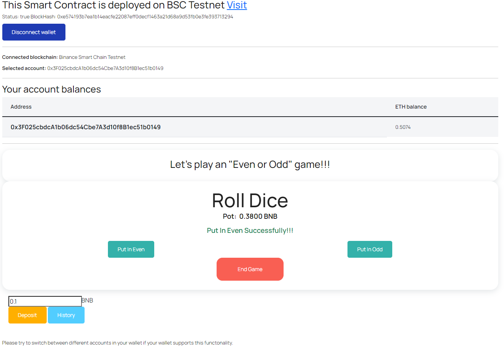

Even Odd Game — Interact with Smart Contract (Part II)
=============

The aim of this project is to provide a simple example of **Web.js** application.

### Include ###
- This Project use HTML and Vanilla Javascript to interact with Smart Contract using **Web3.js** as a bridge
- We chose Django to host the website.

### Simple Workflow ###
- Connect Wallet
- Bet on **Even** or **Odd**
- Click "End Game" to Roll the dice then the Contract will give result & pay winners
- Others: Deposit, check History

### Demo ###
[See the demo](https://quyen2971997.pythonanywhere.com/)

### Smart Contract Main Functions ###
- **deposit()** : Deposit some fund to Smart Contract. The Jackpot shouldn't be empty right? :)
- **putInEven()** : Bet on Even. You will send 0.01 test BNB to contract to play
- **putInOdd()** : Bet on Odd. You will send 0.01 test BNB to contract to play
- **endBet()** : Roll the dice then pay the winners (DOUBLE amount of their bets)
- **Others**... See the contract

### The web3connect.js was encrypted by the JavaScript Obfuscator ###
For some reason I have to encrypt the file. Contact me([LinkedIn](https://www.linkedin.com/in/quyen2971997)) for the file. It's free

### Contract ###
This is the deployed smart contract from BSC Testnet. Feel free to send it some funds. It's free anyway :P
[0x498B0384D00bB9ba49f4eD2C88bc257B110670bc](https://testnet.bscscan.com/address/0x498B0384D00bB9ba49f4eD2C88bc257B110670bc)

### See the previous Part ###
[**Even Odd Game — The Simple Gambling Smart Contract (Part I)**](https://github.com/quyen2971997/solidity-simple-roll-the-dice-game)

